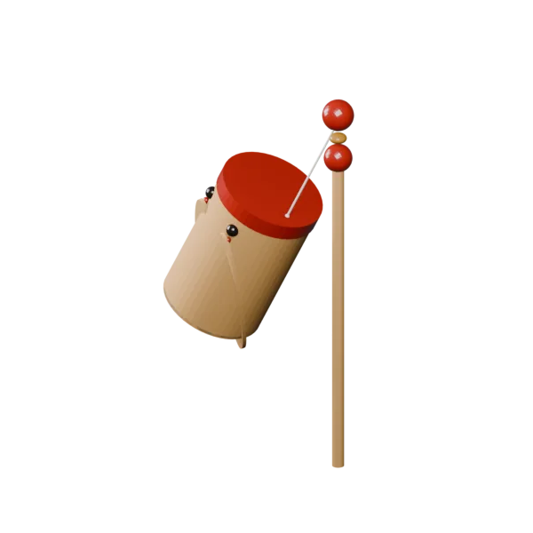

# 竹知了 · Blender 几何节点案例

> 宇宙最好用的开源软件。

一个可拆解、可调参、可继续炼化为节点资产的 Blender 5.2 竹知了案例。摇动甩杆后，知了通过绳系物理产生跟随、惯性和弹性；翅膀可以独立启停和调速；每次新的摇动动作还可以触发一次声音。



## 下载和打开

下载 [`zhuzhiliao_rebuild_v1.blend`](zhuzhiliao_rebuild_v1.blend)，使用 Blender 5.2 或更新版本打开。

仓库只发布当前确认的最终案例，不提交实验版本、过程备份和临时分析文件。

## 怎么玩

1. 选中 `甩杆`，保持 X 轴约 90°，改变本地 Z 旋转或给它打关键帧。
2. 播放时间轴，让 Simulation Zone 按连续帧计算惯性。
3. 在几何节点修改器中调整重力、绳长锁定、弹性、阻尼和翅膀参数。
4. 需要实时声音时，在 Blender 文本编辑器运行一次 `知了_声音触发模块`。
5. 在 `声音触发控制器` 中替换音效、调整音量、移动阈值和静止复位时间。

## 工作原理

### 1. 摇杆提供锚点运动

甩杆末端的绳结是物理系统的动态锚点。它不是直接控制知了的位置，而是持续提供绳子另一端的目标位置。只有跨帧移动时，系统才会获得真实速度和惯性。

### 2. Simulation Zone 保存位置与速度

知了的上一帧位置和速度保存在 Geometry Nodes 的 Simulation Zone 中。每一帧依次计算重力、阻尼、锚点带来的绳方向加速度和弹性响应，再积分得到新的位置。

### 3. 绳子只拉不推

当知了超过允许绳长时，约束把它拉回；绳子松弛时不会反向推开知了。启用“锁定绳长”后，系统会把位置投影回固定半径，获得更像真实玩具的甩动轨迹。

### 4. 翅膀是独立动画模块

翅膀扇动没有耦合进绳子求解器，而是单独的可复用节点组。它可以启停、调速和调幅，后续也能迁移到其他昆虫或机械结构。

### 5. 声音由动作边沿触发

Geometry Nodes 负责画面和物理，Python 模块负责实时声音。脚本每 0.05 秒读取摇杆变换：从静止进入运动时播放一次；持续移动期间不重复；静止超过设定时间后，下一次动作才重新触发。

这与“每一帧都播放声音”不同，可以避免音效叠加和爆音。仓库附带的 `zhuzhiliao-move.wav` 是程序生成的占位鸣叫，可替换为你拥有使用权的录音。

## 可复用模块

- `GN_锚点速度`：把锚点跨帧位移转换为速度信息。
- `GN_弹性绳加速度`：计算只拉不推的弹性绳作用力。
- `GN_可选刚性绳约束`：按开关限制最大或固定绳长。
- `GN_翅膀扇动`：独立控制翅膀启停、速度和幅度。
- `zhuzhiliao_sound_trigger.py`：动作开始时的一次性声音触发器。

完整 `.blend` 是案例；以上模块是可以继续提炼、登记和复用的资产。两者分开保存，避免为了复用一个算法而复制整套场景。

## 项目结构

```text
.
├── index.html                       # GitHub Pages 落地页
├── styles.css                      # 页面样式
├── hero.png                        # Blender 实际渲染封面
├── zhuzhiliao-loop.webp            # 透明循环展示动画
├── zhuzhiliao_rebuild_v1.blend     # 唯一发布的最终案例
├── zhuzhiliao_sound_trigger.py     # 实时声音触发模块
├── zhuzhiliao-move.wav             # 可替换的占位声音
└── README.md
```

## 参考与致谢

本项目的玩具主题、交互方向和物理思路参考了 [imsai-sh/zhuzhiliao](https://github.com/imsai-sh/zhuzhiliao)：一个基于 Canvas、Web Audio 与绳系质点物理的 Web 竹知了。

本仓库没有复制参考项目的真实录音采样或 Web 源码；模型、Geometry Nodes、Simulation Zone、翅膀动画和 Blender 声音触发模块均为独立实现。参考仓库当前未提供独立 LICENSE 文件，使用其内容前请自行确认授权。

## 开源许可

本仓库自行创作的代码和页面使用 [MIT License](LICENSE)。`.blend` 案例与渲染图允许用于学习、修改和非排他性再创作；第三方素材仍遵循各自许可。
